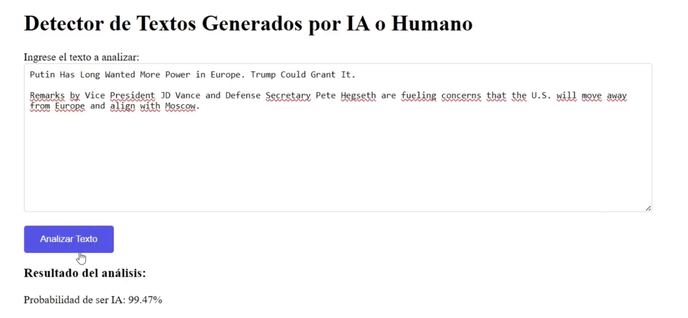

# Verify

Verfiy is an AI text detector, its uses Logistic Regression to detect the posibility of AI generated content inside a given text.

When the user inserts a text, Verify analyze it and shows a the AI ratio in the text

## Frontend

The Frontend of verify was implemented with Angular, it is a simple Frontend design oriented for testing purposes and is not full prepered for launching in production.

<b>Intrface

Intrface with clasification results </b>

## Backend

The integration was implemented in Python using FastApi and unicron libraries, when launching the code, a local API address will be available to interact with the model.

## Additional Resources

For more information on using the Angular CLI, including detailed command references, visit the [Angular CLI Overview and Command Reference](https://angular.dev/tools/cli) page.
